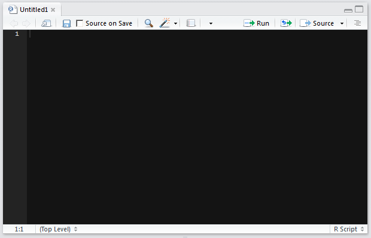
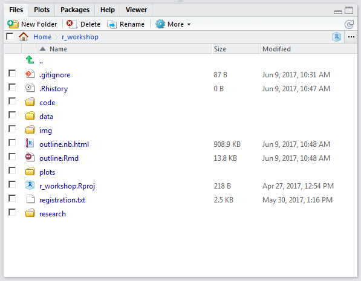
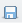

# Outline

## Day 1

----

### Logistics

1) Download the course pack using the following link:
    * <https://github.com/asruesch/r_workshop/archive/master.zip>
    * Or copy it from one of the available flash drives
    * Save it to your Desktop and extract the contents the zip file
2) Ensure RStudio and Excel are installed on your computer

----

### The plan for today

1) Why learn a computer language?
2) Neat things you can do with R
3) Tour of RStudio software
4) Basic R syntax

----

### Why learn a computer programming language?

#### Do you work on a computer?

If so, it's likely you could benefit in some way by learning a programming language. Using a computer without programming skills is like:

* advocating for water quality without understanding the science: you may be able to change the behavior of a few people with your persuasion alone, but you will be much more effective if you can properly communicate the implications of poor water quality, its causes, and the opportunities for restoration.
* making pesto with a knife instead of a food processor: most of the time you're cutting each pine nut one at a time, and occasionally you can get a few all at once. With a food processor, it may take longer to set up, but once it's ready you can make a year's worth of pesto in 10 minutes and the result will be much more consistent.
* making cake with a wheat seed and a baby chicken: rather than beginning from raw materials every time, it would be more effective to first raise many egg-producing chickens, replicate your wheat seed into a field of seed-yielding plants, and build a tool for processing seeds into flour. 

#### Okay, but What is so special about the R language?

* R will soon be the language preferred by most scientists. [Measured by Google Scholar hits](http://r4stats.com/articles/popularity "The Popularity of Data Science Software"), R recently surpassed SAS, and will soon surpass SPSS which has been trending precipitously downward for the last 7 years.
* R is extremely extensible. It was originally designed to be used solely for data analysis and graphics. However, the scope of its use has increased dramatically to include automation, interactivity with other languages, application and web development, GIS, database management, and much more. The key is the involvement of a large (and growing) user base that contributes to the project.
* R is free

#### R can do all sorts of amazing things:

Insert some amazing things here

----

#### Tour of RStudio

R comes in lots of different flavors, but the way that we will be using R for this class is through a software package called RStudio. RStudio packages many of the things you need to be a productive programmer all in place. RStudio can help beginner programmers learn quickly, but it also has enough functionality to satisfy the advanced programmer as well. To start, let's get a feel for the RStudio interface.


First, open RStudio software by clicking on the Windows Start button and typing "rstudio":


----

There are a number of windows in R, but we are going to start by using only one, the R **console**:


----

The R console allows you to type in R code interactively, line-by-line, and print the result. RStudio has many fancy functions, of which we will discuss in more detail as we go along, but basic R software (as opposed to RStudio) is essentially just the console, so you can mentally equate the R program with the mental image of the R console. It's a commmand prompt (```>```, the place where you type in code), plain and simple.

Let's try writing our first line of code. One of the most basic elements of any computer programming language is simple math. Try typing in 2+2 at the command prompt, and hit enter:

```{r}
2+2
```

Notice that the R console returns the result of that mathematical statement. There is a little bracketed ```[1]``` next to the result--all that means is that first item is list directly to the right--we will come back to this later, but for now you can ignore it.

### Exercise

Let's take 5 minutes to try out different mathemeatical statements. Try using different mathematical operators such as addition/subtraction (```+```, ```-```), multiplication/division ( ```*```, ```/```), and exponents (```^```), and parentheses.

----

### Variables

When we type in a mathematical statement in the R console and press enter, it returns the results as a message printed on the screen. As an alternative to having the result returned as a message, we can also save the result to be used later. We do this by **assigning** the result to a **variable**. To tell R to assign a value to a variable, We will use the equals sign (```=```):

```{r}
my_1st_variable = 5
```

Note that wa

We can name the variable anything we want. Here I named it ```my_1st_variable```, but I could just as well have named it ```theodore_roosevelt```, the only rules being that it cannot contain a space, special characters, or start with a number.

Think of a variable as a **container** that you can put anything into--you can also take things out or modify the contents, which is why they are called "variables". Once the contents are stored, we can re-use them as though they have the same value as the contents themselves:


```{r}
my_1st_variable + 5
```

As you create more and more variables, RStudio has a helpful tool for you to keep track of them. There is a tab called "Environment" in the upper-right panel that lists all of your variables for you.


In the same way we write mathematical equations, variables take on the value of the right-hand side of the equation. For example:

```{r}
x = 2 + 2
x + 2
```

So what is the value of x?

*Note: we can use either an equals sign (```=```) or an arrow (```<-```)--which is just the less-than sign followed by a hyphen--to assign a variable. If you want to bring the purist trolls out of the woodwork, ask Google which one you should use. If you want to keep it simple, just pick one and stick with it. In other words, it really doesn't matter which one you use, just be aware of both when reading others' code*

*** Exercise

Take 5 minutes to try out variable assignment using mathematical operators. Try re-using variables in mathematical statements.

----

### scripts

You've probably begun to notice that it is tedious to write every statement of code, line-by-line, one-at-a-time, at the command prompt in the R console. Fortunately, you will not have to do this any longer. Enter the **script**.

A script contains many lines of code that can be executed simultaneously. It is a file stored on your hard drive, much like a .docx or .xlsx file, except it has a .r extension instead. 

RStudio has a feature that makes it very easy to create a script. In the file menu, click new file, and then click R script. A new blank pane should appear:



We are going to save this file on our hard drive, but first, a little house cleaning. We've set up an RStudio **project** for you, which is simply a way of containing many useful elements relating to a project in one place. In the file menu, click Open Project, navigate to the place you stored the course pack, and select the file called "r_workshop.Rproj". Doing so will set up our R session to work out of our course pack folder. You can verify this by clicking the Files tab in the lower-right pane:



A window like the one above should appear with files associated with our class.

Now, let's save our R script. Click the save button on our R script pane:




Notice that RStudio recognizes certain characters and changes their colors. Although you are ultimately writing to a simple text file, because its file extension is ".r", RStudio recognizes that it contains R code, and then helps you visualize it through color. This is one helpful feature of an Integrated Development Environment, or IDE.

One of the most useful features of the RStudio IDE is the ability to run the code in your scripts in your console. With your cursor on the same line as the `print` statement, press `Ctrl+Enter`.

Another very helpful feature for increasing your productivity is tab completion. Try typing in the following text and hitting the tab button:

```{r}
"C:/
```

Notice that RStudio recognizes your file system.

#### Exercise (5 minutes)

See if you can use tab completion to find the folder containing the course pack.


---

### Functions

In the above two statements, we had to deduce the value of x:

```{r}
x = 2 + 2
x + 2
```

It is obvious that the value is 4 because of the simplicity of the statement, but our code is going to get more complex very quickly, so let's introduce a method for telling R to return the value of a variable. We are going to use a **function** called ```print```

```{r}
print(x)
```

An R function *does something*. It is an action statement. Functions are the **verbs** of computer programming. In the case of the above ```print``` function, its action is to print the value of ```x``` as a message to the user. 

The way we use functions in R is by typing their name followed by parentheses (without a space in between). The contents of the parentheses are called the **arguments**. Arguments are how we tell the function what to do. If "jump" were a function, the argument would by "how high?".

A simple function in R that you will likely use a lot is the ```sum``` function.


```{r}
sum(8, 3, 1)
```

The arguments of the above ```sum``` function are the values we want to add together. We seperate arguments of a function by inserting a comma between each.

Each function in R has its own set of arguments. That is, our metaphorical argument "how high?" for our "jump" function would not make sense for a "dance" function.

So how do we know what arguments to use for each function? We can use R help for that. There are two ways to access help for R functions. The first is to use the RStudios help tab in the lower-left pane:


Or, we can simply type a question mark followed by the function name in our console:

```{r}
?print
```

A core function in R that you will become very familiar with is the ```c()``` function. The ```c()``` function allows you to create a vector of values. A vector is a sequence of values:

```{r}
y = c(3,5,7)
print(y)
```

In R, you can do math **across** vectors:

```{r}
z = y * 2
print(z)
```

This may not seem like much, but one of the most powerful aspects of R, and what sets it apart from many other computer programming languages is its ability to do math across sequences of numbers--it is what we refer to as an "array-based language".

### Exercise

Let's take 20 minutes to explore mathematical operators, variables, and functions. Try using vectors with other functions, such as the ```mean()``` and ```stdev()``` (standard deviation) functions.

Now that it's saved, let's add some code to it. We can start by typing in the same line:

```{r}
print("Talk to me, Goose")
```

#### The ```data.frame```

If you are accustomed to using Excel or Access, the data.frame object in R should be very intuitive for you. A data.frame is just a table of data. In a data.frame, each column has a name that identifes the data in it, and the data within a column is all the same type (e.g., letters cannot be mixed with numbers---more on this later). Before we use data.frames in R, let's look at the table that we'd like to use in R. Open the `data_frame.csv` file in Excel and familiarize yourself with the data.

Now we want to read that data into R. To do this, we will use the `read.csv` function. If you remember, a function does something within the context of the arguments passed to it. The `print` function had only one argument, the message to be printed, but the `read.csv` function has several more. Let's take a look at what those arguments are by introducing a new concept in R---the help menu. To access the help menu for any function, all you have to do is type a question mark followed by the function name into the console. For example:

```{r}
?read.csv
```

The help menu for this function should appear in one of the panels in RStudio. You'll notice that the help menu has a specific section for the arguments, and `read.csv` has quite a few. The syntax with passing arguments to a function is the funtion name, with parentheses, and within the parentheses all arguments separated by commas. You'll notice in the help menu that the first argument is `file`. This tells R where in your file system the table is located.

#### Exercise (10 min)
Try running `read.csv` using your `filename` variable, and saving the data to a new variable. To verify that it read correctly, either use the `print` function, or click on your new variable in the *Environement Panel*. Try reading subsets of the table by using the `nrows` and `skip` arguments.

*Hint:* The arguments should be listed in the same order as they are in the help menu, unless they are specifically set with an equals (`=`) operator. For example, the first argument to `read.table` is the file---we can just enter the file first 
  
#### Data types
Strings, numbers, integers
* Each column has a data type show ```str()```--define data types

#### Slicing, subsetting

#### Scatterplot
        * Make a scatterplot
4. Exercise
    - Open the text file but try other arguments
    - Plot the data using different plot arguments


#### For loops


# Exercise

Lots of scatterplots, one big pdf

## Day 2, Using R in your work

```{r}
# At some point on day 2 before my data management section, I presume we will be reading in one of the course datasets. 
d = read.csv("data/TP_CHL_models.csv")
```

a.	More detailed plotting (Yellow)
  i. boxplots
  ii. histogram
  iii. multilayer plots, points with lines, etc.
  iv. axes, labels, other plotting arguments
  v. saving plots (png, pdf)
  vi. exercise

b. Simple Stats (Matt)
  i. Regression
  ii. t-test
  iii. Two-way ANOVA
  iv. Model objects
    1. Re-hash the str() object
    2. summary
    3. p-values
    4. residuals
    5. r.squared
  v.	exercise

----

### Data management

#### Philosophies/Rules

Say you have a task where you need to retrieve a dataset, manipulate the data in a multi-step process, analyze the manipulated data, and return a result. One way to accomplish this task would be to use Excel. If you choose to use Excel, and most of your colleagues use Excel as well, your workflow may look something like this:

1. Open a second-hand .xlsx file, try to understand what the names of the worksheets mean, and hope you select the correct data given that there are bits of fragmented tables strewn about.
2. Create a new .xlsx file, copy and paste your data into it, and save.
3. Create several new worksheets in your .xlsx file, each associated with an intermediate calculation.
4. Send your third-hand .xlsx file to your client/colleague, and they will repeat the above process for their task.

With your new R skills (and working with your colleagues with new R skills), you will be able to improve your workflow to look something like this:

1. Retrieve your data from the original source.
2. Write a script that contains all intermediate processing steps without needing to save any intermediate data.
3. Send your results to your client in a simple, text-based file format such as tab-delimited.

The benefits of the R-driven process is this:

1. Each step in your retrieval, manipultation, analysis, and delivery process is well-documented and repeatable.
2. You are confident you are using the correct data, you have not altered the original data in the process, and you have not created any uneccessary clutter on your hard-drive with intermediate data files.
3. Your data result will be readable 20-30 years from now even though Excel has been deprecated.

To distill the above process, here are a few general guidelines:

1. Refer to the original dataset without altering it
2. Create as few intermediate datasets as possible
3. Save your product in a simple, timeless data format

There are, of course, exceptions to the above rules, but these 3 will serve you well for most tasks.

Let's look at an example workflow using wastewater Discharge Monitoring Report data (DMR):


ii. Pull in multiple tables
  iii. RODBC or ROracle 
    1. Introduce packages
      a. Use base R when possible
      b. Could be worthwhile to learn certain packages rather coding yourself from base functions
      c. Resources for learning new packages

d. MORE WOW FACTOR (everyone contributes)
  i. Shiny
  ii. Spatial Analysis
  iii. Advanced plotting
  iv. Advanced statistics (e.g., ordination, CART, vegan)

e. Tying everything together exercise
  i. Pull in large datasets
  ii. For loop
  iii. Subset
  iv. Fit regression
  v. Scatterplot with abline()
