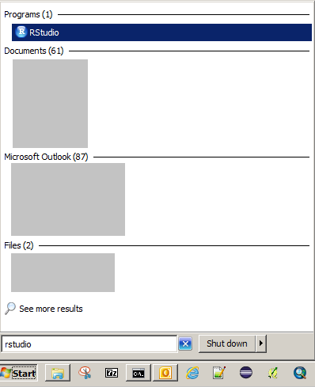
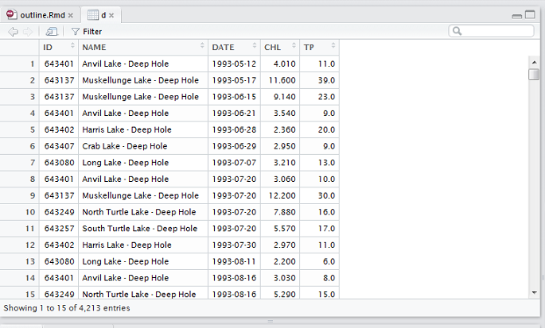
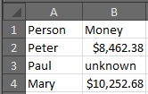
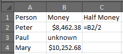
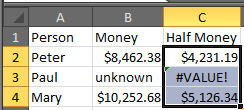

## Logistics

1) Download the course pack using the following link:
    * <http://bit.ly/2s7uBzz>
    * Or copy it from one of the available flash drives
    * Save it wherever you'd like and extract the contents the zip file
2) Ensure RStudio and Excel are installed on your computer

## The plan for today

1) Why learn a computer language?
2) Neat things you can do with R
3) Tour of RStudio software
4) Basic R syntax

# Why learn a computer programming language?

## Do you work on a computer?

If so, it's likely you could benefit in some way by learning a programming language.

## Using a computer without programming skills is like: {.smaller}

* advocating for water quality without understanding the science: you may be able to change the behavior of a few people with your persuasion alone, but you will be much more effective if you can properly communicate the implications of poor water quality, its causes, and the opportunities for restoration.
* making pesto with a knife instead of a food processor: most of the time you're cutting each pine nut one at a time, and occasionally you can get a few all at once. With a food processor, it may take longer to set up, but once it's ready you can make a year's worth of pesto in 10 minutes and the result will be much more consistent.
* making cake with a wheat seed and a baby chicken: rather than beginning from raw materials every time, it would be more effective to first raise many egg-producing chickens, replicate your wheat seed into a field of seed-yielding plants, and build a tool for processing seeds into flour. 

## What is so special about the R language?

* R will soon be the language preferred by most scientists. [Measured by Google Scholar hits](http://r4stats.com/articles/popularity "The Popularity of Data Science Software"), R recently surpassed SAS, and will soon surpass SPSS which has been trending precipitously downward for the last 7 years.
* R is extremely extensible. It was originally designed to be used solely for data analysis and graphics. However, the scope of its use has increased dramatically to include automation, interactivity with other languages, application and web development, GIS, database management, and much more. The key is the involvement of a large (and growing) user base that contributes to the project.
* R is free

# R can do all sorts of amazing things

## Presentations

This slideshow brought to you by R!

## GIS 

```{r fig.width=8, fig.height=4}
library(leaflet)
leaflet() %>%
  addTiles()
```


# Tour of RStudio


R comes in lots of different flavors, but the way that we will be using R for this class is through a software package called RStudio. RStudio packages many of the things you need to be a productive programmer all in place. RStudio can help beginner programmers learn quickly, but it also has enough functionality to satisfy the advanced programmer as well. To start, let's get a feel for the RStudio interface.


First, open RStudio software by clicking on the Windows Start button and typing "rstudio":



----

There are a number of windows in R, but we are going to start by using only one, the R **console**:


----

The R console allows you to type in R code interactively, line-by-line, and print the result. RStudio has many fancy functions, of which we will discuss in more detail as we go along, but basic R software (as opposed to RStudio) is essentially just the console, so you can mentally equate the R program with the mental image of the R console. It's a commmand prompt (```>```, the place where you type in code), plain and simple.

Let's try writing our first line of code. One of the most basic elements of any computer programming language is simple math. Try typing in 2+2 at the command prompt, and hit enter:

```{r}
2+2
```

Notice that the R console returns the result of that mathematical statement. There is a little bracketed ```[1]``` next to the result--all that means is that first item is list directly to the right--we will come back to this later, but for now you can ignore it.

### Exercise

Let's take 5 minutes to try out different mathemeatical statements. Try using different mathematical operators such as addition/subtraction (```+```, ```-```), multiplication/division ( ```*```, ```/```), and exponents (```^```), and parentheses.

----

### Variables

When we type in a mathematical statement in the R console and press enter, it returns the results as a message printed on the screen. As an alternative to having the result returned as a message, we can also save the result to be used later. We do this by **assigning** the result to a **variable**. To tell R to assign a value to a variable, We will use the equals sign (```=```):

```{r}
my_1st_variable = 5
```

Note that wa

We can name the variable anything we want. Here I named it ```my_1st_variable```, but I could just as well have named it ```theodore_roosevelt```, the only rules being that it cannot contain a space, special characters, or start with a number.

Think of a variable as a **container** that you can put anything into--you can also take things out or modify the contents, which is why they are called "variables". Once the contents are stored, we can re-use them as though they have the same value as the contents themselves:


```{r}
my_1st_variable + 5
```

As you create more and more variables, RStudio has a helpful tool for you to keep track of them. There is a tab called "Environment" in the upper-right panel that lists all of your variables for you.


In the same way we write mathematical equations, variables take on the value of the right-hand side of the equation. For example:

```{r}
x = 2 + 2
x + 2
```

So what is the value of x?

*Note: we can use either an equals sign (```=```) or an arrow (```<-```)--which is just the less-than sign followed by a hyphen--to assign a variable. If you want to bring the purist trolls out of the woodwork, ask Google which one you should use. If you want to keep it simple, just pick one and stick with it. In other words, it really doesn't matter which one you use, just be aware of both when reading others' code*

*** Exercise

Take 5 minutes to try out variable assignment using mathematical operators. Try re-using variables in mathematical statements.

----

### scripts

You've probably begun to notice that it is tedious to write every statement of code, line-by-line, one-at-a-time, at the command prompt in the R console. Fortunately, you will not have to do this any longer. Enter the **script**.

A script contains many lines of code that can be executed simultaneously. It is a file stored on your hard drive, much like a .docx or .xlsx file, except it has a .r extension instead. 

RStudio has a feature that makes it very easy to create a script. In the file menu, click new file, and then click R script. A new blank pane should appear:


We are going to save this file on our hard drive, but first, a little house cleaning. We've set up an RStudio **project** for you, which is simply a way of containing many useful elements relating to a project in one place. In the file menu, click Open Project, navigate to the place you stored the course pack, and select the file called "r_workshop.Rproj". Doing so will set up our R session to work out of our course pack folder. You can verify this by clicking the Files tab in the lower-right pane:


A window like the one above should appear with files associated with our class.

Now, let's save our R script. Click the save button on our R script pane:


Notice that RStudio recognizes certain characters and changes their colors. Although you are ultimately writing to a simple text file, because its file extension is ".r", RStudio recognizes that it contains R code, and then helps you visualize it through color. This is one helpful feature of an Integrated Development Environment, or IDE.

One of the most useful features of the RStudio IDE is the ability to run the code in your scripts in your console. With your cursor on the same line as the `print` statement, press `Ctrl+Enter`.

Another very helpful feature for increasing your productivity is tab completion. Try typing in the following text and hitting the tab button:

```{r}
"C:/"
```

Notice that RStudio recognizes your file system.

#### Exercise (5 minutes)

See if you can use tab completion to find the folder containing the course pack.


---

### Functions

In the above two statements, we had to deduce the value of x:

```{r}
x = 2 + 2
x + 2
```

It is obvious that the value is 4 because of the simplicity of the statement, but our code is going to get more complex very quickly, so let's introduce a method for telling R to return the value of a variable. We are going to use a **function** called ```print```

```{r}
print(x)
```

An R function *does something*. It is an action statement. Functions are the **verbs** of computer programming. In the case of the above ```print``` function, its action is to print the value of ```x``` as a message to the user. 

The way we use functions in R is by typing their name followed by parentheses (without a space in between). The contents of the parentheses are called the **arguments**. Arguments are how we tell the function what to do. If "jump" were a function, the argument would by "how high?".

A simple function in R that you will likely use a lot is the ```sum``` function.


```{r}
sum(8, 3, 1)
```

The arguments of the above ```sum``` function are the values we want to add together. We seperate arguments of a function by inserting a comma between each.

Each function in R has its own set of arguments. That is, our metaphorical argument "how high?" for our "jump" function would not make sense for a "dance" function.

So how do we know what arguments to use for each function? We can use R help for that. There are two ways to access help for R functions. The first is to use the RStudios help tab in the lower-left pane:


Or, we can simply type a question mark followed by the function name in our console:

```{r eval=FALSE}
?print
```

A core function in R that you will become very familiar with is the ```c()``` function. The ```c()``` function allows you to create a vector of values. A vector is a sequence of values:

```{r}
y = c(3,5,7)
print(y)
```

In R, you can do math **across** vectors:

```{r}
z = y * 2
print(z)
```

This may not seem like much, but one of the most powerful aspects of R, and what sets it apart from many other computer programming languages is its ability to do math across sequences of numbers--it is what we refer to as an "array-based language".

### Exercise

Let's take 20 minutes to explore mathematical operators, variables, and functions. Try using vectors with other functions, such as the ```mean()``` and ```stdev()``` (standard deviation) functions.


## The `data.frame`

If you are accustomed to using Excel or Access, the data.frame object in R should be very intuitive for you. A data.frame is just a table of data. 

In a data.frame, each column has a name and number that identify the data in it, and the data within a column is all the same type. 

Before we use data.frames in R, let's look at the table that we'd like to use. Open the `Vilas_TP_CHL_data.csv` file in Excel (in the /data folder) and familiarize yourself with the data.

## The `data.frame`

Now we want to read that data into R. To do this, we will use the `read.csv` function. If you remember, a function does something within the context of the arguments passed to it. The `print` function had only one argument, the message to be printed, but the `read.csv` function has several more. Let's take a look at what those arguments are using the help menu.

```{r eval=FALSE}
?read.csv
```

## The `data.frame`

You'll notice that the help menu shows the usage of `read.csv` and some similar functions, and a specific section with descriptions of each argument - `read.csv` has quite a few. 

Let's look at the Usage section. You'll notice in the help menu that the first argument passed to `read.csv` is `file`. This tells R where in your file system the table is located, and is required for the function to run. All of the other arguments (`header`,`sep`,etc.) have default values and are thus not required to be entered by the user. Default values are shown in the Usage section with an `=` sign: `read.csv(file,header=TRUE)`. Remember, you can always find more informatin about each argument by scrolling down to the Arguments section, or googling!

## The `data.frame`

Let's use what we've learned about read.csv to load in the data.frame

```{r}
d = read.csv("data/Vilas_TP_CHL_data.csv")
```

Notice how we give the file name and its location within the *data* folder? Because we are using an RStudio project, our `working directory` is the folder associated with the project - in this case, it is the *r_workshop* folder. So, our file path starting with "data/" tells R to look for a folder called *data* within *r_workshop*

## The `data.frame`

Once we have the data.frame read into R and saved as an object, we'll want to view it, check that the data were read in correctly, check column names, check numbers of rows and columns, etc. Since you don't always have a spreadsheet of the data in front of you, it's useful to become familiar with interpreting these attributes of your data. We can explore our data.frame in a few ways. 

First, let's introduce a few useful functions. `str` (meaning "structure") is one you should become fluent in. For a data.frame, it only requires one argument: the name of your data.frame. Let's see the structure of our data.frame:

```{r,eval=FALSE}
str(d)
```

## The `data.frame`

```{r}
str(d)
```
There are a few useful outputs: the number of observations (rows) and variables (columns), the name of each column, whether each column is numeric, integer, etc. (more on data.types next), and the first several entries of each column. 

## The `data.frame`

Sometimes, it's easier to just look at the data.frame in table form though. To do that, we can just run `print(d)` or `d` for short. This will print the data.frame in the console, but gets messy if you have more than a few rows or columns. 

One way to get around that is to use `head` or `tail` which only show you the top or bottom of your data.frame, but can still be messy if we have many columns. 
```{r}
head(d)
```

## The `data.frame`

Finally, RStudio has another nice feature that lets us view our data.frame a little more like a spreadsheet - just double-click on the name of your data.frame in the Environment window or use `View(df)`. 



## The `data.frame`

If we just want to see the names of the variables, we can use `names` or `colnames`.

```{r}
colnames(d)
```

Finally, we may want some idea of how big our data.frame is. To get the number of rows, use `nrow`. For the number of columns, use `ncol`.

```{r}
nrow(d)
```

## The `data.frame`

What if we just want to look at a particular column? You may have noticed that the names of each variable in the output of the `str` command were preceded by a `$`. We can use this to reference particular columns by name. Say we just want to look at the lake names in our dataset. We know that column is called "NAME". To access it, we use: 

```{r}
d$NAME
```

## `data.frame` exercise (5 min)

If you haven't already, run `read.csv` using your `filename` variable, and saving the data to a new variable. Try it with the other .csv files we've provided as well. To verify that they read correctly, view the data.frame by printing it or clicking on the name in the *Environment* panel. Try reading subsets of the table by using the `nrows` and `skip` arguments. Explore your data.frame using `str`, `head`, `tail`, `names`, `colnames`, `nrow`, and `ncol` functions, and access specific columns with `$`. 

*Hint:* The arguments should be listed in the same order as they are in the help menu, unless they are specifically set by with an equals (`=`) operator (e.g., "argument=___". For example, the first argument to `read.csv` is the file---we can just enter the file first 
  
## Data types

Let's say you are working in Excel, and you want to create a column that contains quantities of money associated with different people.



Then, let's say you want to divide those quantities by two:



If we apply that same function to all cells in that column, we get an error when Excel tries to calculate half of the value "unknown"



This is because Excel does not recognize the "unknown" value as something divisible. The "unknown" value is a different date **type**. The division operator in Excel only recognizes numeric data types and therefore throws in error, and R will do the same with mismatches in data types.

There are many data types in R, but in this section, we'll introduce 4 important types, numeric, integer, character, and logical.

#### Numbers

The two data types that represent numbers are "numeric" and "integer". A numeric data type is a quantity with a decimal point (sometimes referred to as "float" or "double" in other programming languages), and an integer is a quantity without a decimal point, simple as that! You can use the ```class``` function to query the data type of a value:

```{r}
class(1.5)
class(1)
```

Notice that value of 1 is defined as a numeric data type. If you want to be explicit about defining an integer, you must use a **coercion** function. Each data type has a coercion function--the name of the function is just the data type preceded by ```as.```, such as ```as.numeric``` or ```as.integer```.

```{r}
class(as.integer(1))
```

#### Characters

"Characters" (often referred to as "strings" in other programming languages) can include alphabet letters, digits, and special symbols, but are all treated as text. Characters can be defined by wrapping them in quotes:

```{r}
class("This is a character data type")
class("Numbers (1) and symbols ($) can be included in characters")
class("1")
```

You can also coerce a value to a character using its coercion function:

```{r}
char_var = as.character(1.52342)
print(char_var)
class(char_var)
```

#### Logical

The final data type we'll talk about today is the "logical" data type. The logical data type is the simplest because it can take on only two values, TRUE and FALSE:

```{r}
class(TRUE)
```

The values TRUE and FALSE are only considered logical data type if written in these ways:

```{r}
# All caps
class(TRUE)
class(FALSE)
# Capital T or F
class(T)
class(F)
# 0 or 1
class(as.logical(0))
class(as.logical(1))
```

#### Exercise

Take 5 minutes to test different functionality on different data types to see how R behaves (for example, try dividing an integer or multiplying by a character).

----

#### Data types and data frames

Data types become more important in data frames. In a data frame, a column can only contain values of a single data type. For example, a column intended to contain numeric data (such as the money column in our Excel table), will give us problems if we try to add any non-numeric data. A very helpful function for quickly identifying the types of each column in a data frame is the ```str``` function:

```{r}
str(d)
```

After each column, the data type is listed (e.g., int = integer, num = numeric)

*Note the column with the "Factor" data type. Factors are slightly more in-depth than the scope of this class. To suppress the factor data type in a data frame, you can use the ```{r} stringsAsFactors=FALSE``` argument to the ```read.csv``` function to coerce the factor columns to character data types:

```{r}
d = read.csv("data/Vilas_TP_CHL_data.csv", stringsAsFactors=FALSE)
str(d)
```


We can easily view the data types of a data frame using the ```str``` function:

```{r}
str(d)
```

----

#### Slicing, subsetting

## Scatterplots
        
* A HUGE benefit of R is its ability to produce customizable, complex, and downright pretty visualizations of data. A drawback of a 2-day workshop is that we can't quite teach you all of that. 

* We can teach you the basics, which act as building blocks toward higher-level graphics. 

## Scatterplots

We'll come back to making figures tomorrow, but by this point in the workshop, you've earned the right to see what the data look like outside of a data.frame. The key building block in making graphics is the `plot` function. This is a highly versatile function - it can take lots of different data and object types as inputs. The default usage is to just give it x and y coordinates in the form `plot(x,y)`, and it will output a scatterplot. In RStudio, this will show up in its own panel. The `x` and `y` arguments can be single values, vectors of values, or columns from a data.frame.   

```{r,eval=FALSE}
plot(d$TP,d$CHL)
```

## Scatterplots
```{r}
plot(d$TP,d$CHL)
```

## Scatterplot Exercise (5 min)
Use your data.frame to play around with making simple scatterplots. Try to integrate some of your knowledge of data subsetting to remake the plot for different lakes. 

If you have time, try creating at least 2 new vectors with the `c` function and plotting those. 


4. Exercise
    - Open the text file but try other arguments
    - Plot the data using different plot arguments


#### For loops


# Exercise

Lots of scatterplots, one big pdf

## Day 2, Using R in your work

### Logistics

1) Download the course pack using the following link:
    * <http://bit.ly/2s7uBzz>
    * Or copy it from one of the available flash drives
    * Save it wherever you'd like and extract the contents the zip file

```{r}
# We should have a script here that ensures all attendees have the same working directory, variables, etc.
# Have them run this at the beginning of class
model = read.csv("data/TP_CHL_models.csv")
d = read.csv("data/Vilas_TP_CHL_data.csv")
```

## More detailed plotting

Yesterday, we showed you how to make simple scatterplots. But, there are numerous other types of plots you can make, infinite ways to customize them, and some techniques for creating publication or web-quality figures. Today, we'll introduce  you to a bit of all of the above. 


## Other plot types

The basic `plot` command is versatile and can take various types of input arguments, but there are other functions. For instance, if you want to make a boxplot, then the `boxplot` command might suit you.  


```{r, fig.height=3.9,fig.width=4}
boxplot(d$TP,log="y")
```

## Other plot types

Or using formula notation...

```{r, fig.height=3.5,fig.width=8.8}
#subset lakes to those w/ "Dead Pike" in name:
deadpike = d[grepl("Dead Pike",d$NAME),] 
deadpike$NAME = factor(deadpike$NAME) #reset factors
boxplot(deadpike$TP~deadpike$NAME,log="y",cex.axis=0.7)
```

## Other plot types

If you want to make a histogram, `hist` will probably work.

```{r}
hist(d$TP)
```

## Other plot types

These and many other functions exist, and they're not too hard to find. Just google them (e.g., "R histogram"). Feel free to try to find other plot types that you can make in R on your own. 

## Customizing plots

For now though, let's go back to our basic scatterplot and learn how to customize it (aka, add complexity and make it pretty). 

```{r}
plot(d$TP,d$CHL)
```

## Customizing plots

For simplicity, let's limit it to one lake:
```{r,fig.height=3.4}
kentuck = d[d$NAME=="Kentuck Lake - Site 2-East End-Deep Hole",]
plot(kentuck$TP,kentuck$CHL)
```

## Customizing plots

First, let's say we want to make a scatterplot with an overlayed line that compares our points to an existing model. The general approach in R is to first create your simple plot, and then add features to it. You can add features with a number of functions, including `lines`, `points`, `polygon`, and more. These don't create plots on their own - they add lines, points, or a polygon to a plot that has already been made and is currently active. 

For our example, we'll  use the 2nd data.frame from our project folder, which already has modeled chlorophyll as a function of TP. The units are log-transform though, so we'll untransform using `exp`.

```{r,eval=FALSE}
plot(kentuck$TP,kentuck$CHL)
lines(exp(model$logTP),exp(model$fit))
```

## Customizing plots
```{r, fig.height=3.5,fig.width=7.5}
plot(kentuck$TP,kentuck$CHL)
lines(exp(model$logTP),exp(model$fit))
```
Great, now you have a multi-layer plot. 'Tis a shame that it's pretty ugly! Let's spruce it up!

##Customizing plots
You may have noticed that in the `plot` help file, there are many arguments, including  `xlab` and `ylab` to name your axes and `main` for the plot title. These arguments require text strings: 

```{r, fig.height=3}
plot(kentuck$TP,kentuck$CHL,
     xlab="Total Phosphorus",
     ylab="Chlorophyll",
     main="") #this makes sure that the title is left blank
```

## Customizing plots

Then, in the help files for `plot`, `lines`, etc., there is something called "Further graphical parameters (see par)...". `par` is essentially a set of default  parameters. Use `?par` to see the numerous options. We won't walk through them all  now, but they are worth exploring. Many of them can be changed within the `plot` command. Let's take a look at some common ones

## Customizing plots
  
argument | description                          | example
-------- | ------------------------------------ | -------
log      | log-transform axes?                  | log="x"
col      | symbol color                         | col="blue"
bg       | background color of a symbol         | bg="skyblue"
pch      | dot type                             | pch=21
cex      | text and symbol size (relative to 1) | cex=1.5
lty      | line type                            | lty=2
lwd      | line width                           | lwd=3
las      | axis label direction                 | las=1

##Customizing plots
Let's first use the `log` argument to log both axes. 

```{r,fig.height=3.1}
plot(kentuck$TP,kentuck$CHL,
     xlab="Total Phosphorus",
     ylab="Chlorophyll",
     main="",log="xy") #transforms both axes into log-scale
lines(exp(model$logTP),exp(model$fit))
```

## Customizing plots
Now, let's change the point and line types. A simple way to find what types are available is to google "r pch" or "r lty".

```{r,fig.height=3.1}
plot(kentuck$TP,kentuck$CHL,pch=21,
     xlab="Total Phosphorus",
     ylab="Chlorophyll",
     main="",log="xy") 
lines(exp(model$logTP),exp(model$fit),lty=2)
```

## Customizing plots
Now, add some color. Colors can be pretty intuitive ("black","red", etc.). You can also google image "r colors" to see pre-named colors, or you can provide RGB codes in the form "#RRGGBB", or use existing color palettes and functions (e.g. (rainbow). 
```{r,fig.height=3.1,eval=FALSE}
plot(kentuck$TP,kentuck$CHL,pch=21,col="seagreen",bg="seagreen1",
     xlab="Total Phosphorus",
     ylab="Chlorophyll",
     main="",log="xy") 
lines(exp(model$logTP),exp(model$fit),lty=2,col="seagreen4")
```

##Customizing plots
```{r,fig.height=3.7}
plot(kentuck$TP,kentuck$CHL,pch=21,col="seagreen",bg="seagreen1",
     xlab="Total Phosphorus",
     ylab="Chlorophyll",
     main="",log="xy") 
lines(exp(model$logTP),exp(model$fit),lty=2,col="seagreen4")
```


## Customizing plots
Now, let's increase the dot size and line thickness
```{r,fig.height=3.1}
plot(kentuck$TP,kentuck$CHL,pch=21,col="seagreen",bg="seagreen1",
     cex=1.2,
     xlab="Total Phosphorus",
     ylab="Chlorophyll",
     main="",log="xy") 
lines(exp(model$logTP),exp(model$fit),lty=2,col="seagreen4",lwd=2)
```

## Customizing plots
Change the orientation of the axis-tick labels (so they all read left-to-right)
```{r,fig.height=3.1}
plot(kentuck$TP,kentuck$CHL,pch=21,col="seagreen",bg="seagreen1",
     cex=1.2,las=1,
     xlab="Total Phosphorus",
     ylab="Chlorophyll",
     main="",log="xy")
lines(exp(model$logTP),exp(model$fit),lty=2,col="seagreen4",lwd=2)
```


## Customizing plots
Now, let's finally try to get rid of that useless white space at the top of our plot. To do that, we'll introduce a new way to control `par` settings. 

There are some arguments that can only be set in a specific call to the `par` function, instead of within `plot`.  `mar` is an argument thats takes a vector of 4 values, where each is the number of lines of space provided on each side of the plot in the form c(bottom, left, top, right). The default is c(5.1,4.1,4.1,2). So, R is providing 4.1 lines of space above the plot (the 3rd value in that vector). To reduce that to something small, we just reset its value in par: `par(mar=c(5.1,4.1,0.5,2))`. 

## Customizing plots
```{r,fig.height=3.5}
par(mar=c(4,4,0.25,0.25))
plot(kentuck$TP,kentuck$CHL,pch=21,col="seagreen",bg="seagreen1",
     cex=1.2,las=1,xlab="Total Phosphorus",
     ylab="Chlorophyll",main="",log="xy") 
lines(exp(model$logTP),exp(model$fit),lty=2,col="seagreen4",lwd=2)
```

## Customizing plots
One of the things that `par` allows us to do is multi-panel plotting. Perhaps you noticed that each time you ran the `plot` function, the previous plot was overwritten. What if you wanted two plots on the same figure, next to each other? Before creating the first plot, we can use `par` to tell R that we're going to create 2 plots in the figure. There are two `par` arguments that control this: `mfrow` and `mfcol`. I think of the "mf" as "multiple figures" and "col" or "row" to indicate the number of columns or rows, respectively, and how many items in each one. Thus, `par(mfrow=c(3,2))` creates a 6-panel plot with 3 rows of 2 items (columns) each. To make two plots side-by-side, we can use `par(mfrow=c(1,2))`. 

## Customizing plots

```{r,eval=FALSE}
#first make a data.frame for a different lake to plot in the 2nd panel
sTwin = d[d$NAME=="South Twin Lake - Deep Hole",]

#set up our plot
par(oma=c(0,0,0.25,0),mfrow=c(1,2),mar=c(4,4,.2,.3))  #now use oma for outer margins
plot(kentuck$TP,kentuck$CHL,pch=21,col="seagreen",bg="seagreen1",
     cex=1.2,las=1,xlab="Total Phosphorus",
     ylab="Chlorophyll",main="",log="xy") 
lines(exp(model$logTP),exp(model$fit),lty=2,col="seagreen4",lwd=2)

plot(sTwin$TP,sTwin$CHL,pch=21,col="seagreen",bg="seagreen1",
     cex=1.2,las=1,xlab="Total Phosphorus",
     ylab="Chlorophyll",main="",log="xy") 
lines(exp(model$logTP),exp(model$fit),lty=2,col="seagreen4",lwd=2)
```

##Customizing plots
```{r,echo=FALSE}
#first make a data.frame for a different lake to plot in the 2nd panel
sTwin = d[d$NAME=="South Twin Lake - Deep Hole",]

#set up our plot
par(oma=c(0,0,0.25,0),mfrow=c(1,2),mar=c(4,4,.2,.3)) 
plot(kentuck$TP,kentuck$CHL,pch=21,col="seagreen",bg="seagreen1",
     cex=1.2,las=1,xlab="Total Phosphorus",
     ylab="Chlorophyll",main="",log="xy") 
lines(exp(model$logTP),exp(model$fit),lty=2,col="seagreen4",lwd=2)

plot(sTwin$TP,sTwin$CHL,pch=21,col="seagreen",bg="seagreen1",
     cex=1.2,las=1,xlab="Total Phosphorus",
     ylab="Chlorophyll",main="",log="xy") 
lines(exp(model$logTP),exp(model$fit),lty=2,col="seagreen4",lwd=2)
```

## Customizing plots
Let's improve this plot by doing 2 things to make it easier to compare between lakes

1. Set the axis limits so that they are equal between the two plots
2. Add a label identifying each lake

## Customizing plots
To set the axis limits, we can use the arguments `xlim` and `ylim` in conjunction with the `range` function to find the min and max. 

```{r}
xlimits = range(c(kentuck$TP,sTwin$TP))
ylimits = range(c(kentuck$CHL,sTwin$CHL))
```

## Customizing plots
```{r,eval=FALSE}
par(oma=c(0,0,0.25,0),mfrow=c(1,2),mar=c(4,4,.2,.3)) 
plot(kentuck$TP,kentuck$CHL,pch=21,col="seagreen",bg="seagreen1",
     cex=1.2,las=1,xlab="Total Phosphorus",
     ylab="Chlorophyll",main="",log="xy",
     xlim=xlimits,ylim=ylimits) 
lines(exp(model$logTP),exp(model$fit),lty=2,col="seagreen4",lwd=2)

plot(sTwin$TP,sTwin$CHL,pch=21,col="seagreen",bg="seagreen1",
     cex=1.2,las=1,xlab="Total Phosphorus",
     ylab="Chlorophyll",main="",log="xy",
     xlim=xlimits,ylim=ylimits) 
lines(exp(model$logTP),exp(model$fit),lty=2,col="seagreen4",lwd=2)
```

## Customizing plots
```{r,echo=FALSE}
par(oma=c(0,0,0.25,0),mfrow=c(1,2),mar=c(4,4,.2,.3)) 
plot(kentuck$TP,kentuck$CHL,pch=21,col="seagreen",bg="seagreen1",
     cex=1.2,las=1,xlab="Total Phosphorus",
     ylab="Chlorophyll",main="",log="xy",
     xlim=xlimits,ylim=ylimits) 
lines(exp(model$logTP),exp(model$fit),lty=2,col="seagreen4",lwd=2)

plot(sTwin$TP,sTwin$CHL,pch=21,col="seagreen",bg="seagreen1",
     cex=1.2,las=1,xlab="Total Phosphorus",
     ylab="Chlorophyll",main="",log="xy",
     xlim=xlimits,ylim=ylimits) 
lines(exp(model$logTP),exp(model$fit),lty=2,col="seagreen4",lwd=2)
```

## Customizing plots
We could easily add Lake Name labels with the `main` argument in `plot`. However, in this case we'd prefer to have the lake names in the upper left space within the plots.

To do this, we can use the `text` or `legend` function. These work like `lines` in that they plot onto an active graphic. For `text`, you supply the x & y coordinates where the text should go, and the text itself. In this case, we'll use `legend` to take advantage of its use of location keyworks (e.g., "topleft").

```{r,eval=FALSE}
legend("topleft", #give the location by keyword
       "Kentuck Lake", #the contents of the legend
       bty="n") #bty means box type around legend, "n" means none
```

## Customizing plots
```{r,eval=FALSE}
par(oma=c(0,0,0.25,0),mfrow=c(1,2),mar=c(4,4,.2,.3)) 
plot(kentuck$TP,kentuck$CHL,pch=21,col="seagreen",bg="seagreen1",
     cex=1.2,las=1,xlab="Total Phosphorus",
     ylab="Chlorophyll",main="",log="xy",
     xlim=xlimits,ylim=ylimits) 
lines(exp(model$logTP),exp(model$fit),lty=2,col="seagreen4",lwd=2)
legend("topleft","Kentuck Lake",bty="n")

plot(sTwin$TP,sTwin$CHL,pch=21,col="seagreen",bg="seagreen1",
     cex=1.2,las=1,xlab="Total Phosphorus",
     ylab="Chlorophyll",main="",log="xy",
     xlim=xlimits,ylim=ylimits) 
lines(exp(model$logTP),exp(model$fit),lty=2,col="seagreen4",lwd=2)
legend("topleft","South Twin Lake",bty="n")
```

## Customizing plots
```{r,echo=FALSE}
par(oma=c(0,0,0.25,0),mfrow=c(1,2),mar=c(4,4,.2,.3)) 
plot(kentuck$TP,kentuck$CHL,pch=21,col="seagreen",bg="seagreen1",
     cex=1.2,las=1,xlab="Total Phosphorus",
     ylab="Chlorophyll",main="",log="xy",
     xlim=xlimits,ylim=ylimits) 
lines(exp(model$logTP),exp(model$fit),lty=2,col="seagreen4",lwd=2)
legend("topleft","Kentuck Lake",bty="n")

plot(sTwin$TP,sTwin$CHL,pch=21,col="seagreen",bg="seagreen1",
     cex=1.2,las=1,xlab="Total Phosphorus",
     ylab="Chlorophyll",main="",log="xy",
     xlim=xlimits,ylim=ylimits) 
lines(exp(model$logTP),exp(model$fit),lty=2,col="seagreen4",lwd=2)
legend("topleft","South Twin Lake",bty="n")
```

## Saving plots

Finally, what if we want to save our plot so that it exists outside of our R session? The recommended strategy is to use a graphic devices function, which give you full control over dimensions, resolution, background color, etc. The functions are named pretty intuitively: `pdf`, `png`, `jpeg`, `tiff`, etc. The arguments include: filename, width, height, units, and res. Units can be "px" (default), "in", "cm", or "mm" - for images that I use in powerpoints or documents, I generally use "in", as these are typically easy to fit onto a slide or a page. Then, you can set width and height to typical dimensions (width=6,height=4). "res" defines the dots/pixels per inch for bitmap type images. Generally, 150 is sufficient for presentations, 300 is good for print, but some publications require higher. "filename" is whatever you want to name the file with the appropriate file extension, which will be saved to the working directory, or you can supply the path and filename to save it elsewhere. 

Now that you know what information to give the graphic device function, how does it work in conjunction with your plotting code. When you run a `png` function for instance, nothing seems to happen in RStudio. However, behind the scenes, R opens a new graphical device, onto which all the subsequent lines of code will be run and plotted. At the end of those lines of code, we need to tell R to stop the plotting and save the .png file. We can do this by telling R to shut off the graphical device. We can do that by running `dev.off`. Let's see how all this comes together to create and save a figure...

 #show example here

#### Exercise
Whoever makes the prettiest plot wins! (By entirely subjective standards, of course)

Play around with creating and customizing prettier plots in R, starting with the data.frames you worked with yesterday. Play with the settings for axes, colors, point and line types, point sizes and line widths, margin sizes, multipanel plots, and saving them. 

a.	More detailed plotting (Yellow)
  i. boxplots
  ii. histogram
  iii. multilayer plots, points with lines, etc.
  iv. axes, labels, other plotting arguments
  v. saving plots (png, pdf)
  vi. exercise

b. Simple Stats (Matt)
  i. Regression
  ii. t-test
  iii. Two-way ANOVA
  iv. Model objects
    1. Re-hash the str() object
    2. summary
    3. p-values
    4. residuals
    5. r.squared
  v.	exercise

----

### Data management

#### Philosophies/Rules

Say you have a task where you need to retrieve a dataset, manipulate the data in a multi-step process, analyze the manipulated data, and return a result. One way to accomplish this task would be to use Excel. If you choose to use Excel, and most of your colleagues use Excel as well, your workflow may look something like this:

1. Open a second-hand .xlsx file, try to understand what the names of the worksheets mean, and hope you select the correct data given that there are bits of fragmented tables strewn about.
2. Create a new .xlsx file, copy and paste your data into it, and save.
3. Create several new worksheets in your .xlsx file, each associated with an intermediate calculation.
4. Send your third-hand .xlsx file to your client/colleague, and they will repeat the above process for their task.

With your new R skills (and working with your colleagues with new R skills), you will be able to improve your workflow to look something like this:

1. Retrieve your data from the original source.
2. Write a script that contains all intermediate processing steps without needing to save any intermediate data.
3. Send your results to your client in a simple, text-based file format such as tab-delimited.

The benefits of the R-driven process is this:

1. Each step in your retrieval, manipultation, analysis, and delivery process is well-documented and repeatable.
2. You are confident you are using the correct data, you have not altered the original data in the process, and you have not created any uneccessary clutter on your hard-drive with intermediate data files.
3. Your data result will be readable 20-30 years from now even though Excel has been deprecated.

To distill the above process, here are a few general guidelines:

1. Refer to the original dataset without altering it
2. Create as few intermediate datasets as possible
3. Save your product in a simple, timeless data format

There are, of course, exceptions to the above rules, but these 3 will serve you well for most tasks.

Let's look at an example workflow using wastewater Discharge Monitoring Report data (DMR):


ii. Pull in multiple tables
  iii. RODBC or ROracle 
    1. Introduce packages
      a. Use base R when possible
      b. Could be worthwhile to learn certain packages rather coding yourself from base functions
      c. Resources for learning new packages

d. MORE WOW FACTOR (everyone contributes)
  i. Shiny
  ii. Spatial Analysis
  iii. Advanced plotting
  iv. Advanced statistics (e.g., ordination, CART, vegan)

e. Tying everything together exercise
  i. Pull in large datasets
  ii. For loop
  iii. Subset
  iv. Fit regression
  v. Scatterplot with abline()
